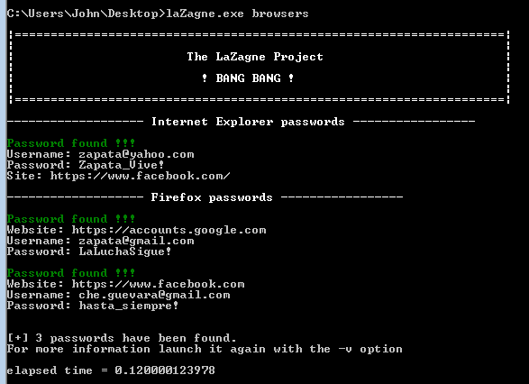

__The LaZagne Project !!!__
==

Description
----
The __LaZagne project__ is an open source application used to __retrieve lots of passwords__ stored on a local computer. 
Each software stores its passwords using different techniques (plaintext, APIs, custom algorithms, databases, etc.). This tool has been developed for the purpose of finding these passwords for the most commonly-used software. 

<p align="center"></p>

Standalones
----
Standalones are now available here: https://github.com/AlessandroZ/LaZagne/releases/

Usage
----
* Retrieve version
```
laZagne.exe --version
```

* Launch all modules
```
laZagne.exe all
```

* Launch only a specific module
```
laZagne.exe browsers
```

* Launch only a specific software script
```
laZagne.exe browsers -f (for firefox)
```

* Write all passwords found into a file (-oN for Normal txt, -oJ for Json, -oA for All)
```
laZagne.exe all -oN
```

* Get help
```
laZagne.exe -h
laZagne.exe browsers -h
```

* Use a file for dictionary attacks (used only when it's necessary: mozilla masterpassword, system hahes, etc.). The file has to be a wordlist in cleartext (no rainbow), it has not been optmized to be fast but could useful for basic passwords.
```
laZagne.exe all -path file.txt
```

* Change verbosity mode (2 different levels)
```
laZagne.exe all -vv
```

__Note: For wifi passwords \ Windows Secrets, launch it with administrator privileges (UAC Authentication / sudo)__

Supported software
----

<p align="center"></p>

(*) used by many tools to store passwords: Chrome, Owncloud, Evolution, KMail, etc.

For developers
----
Please refer to the wiki before opening an issue to understand how to compile the project or to develop a new module.
https://github.com/AlessandroZ/LaZagne/wiki

----
| __Alessandro ZANNI__    |
| ------------- |
| __zanni.alessandro@gmail.com__  |

